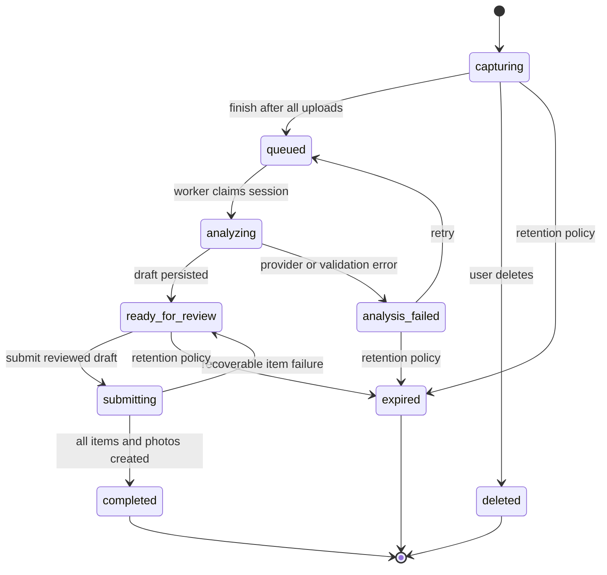

# AI Capture Sessions

| Status | Last updated |
| --- | --- |
| Implemented | 2026-08-16 |

## Summary

AI Capture Sessions separate taking photos from AI analysis and item review. A user selects a location, opens a continuous camera, takes several photos without leaving the camera view, and finishes the capture when ready. HomeBox uploads each photo in the background, analyzes the sealed photo set, and saves an editable draft for later review.

The session is durable. After the server has received the photos, the user may close the page, use another part of HomeBox, or return on another device. Inventory items are not created until the user reviews and submits the AI draft.

## Problem

The current AI Capture page uses a file input with `capture="environment"`. On phones, every photo leaves the HomeBox page for the system camera and then returns to a photo-management screen. Photos and AI drafts live only in page memory, and the browser uploads the entire batch when the user starts analysis. Reloading or leaving the page loses the unfinished capture.

This makes high-volume capture slow and fragile:

- The camera must be reopened for every photo.
- Photo review interrupts the act of capturing.
- Analysis blocks the current flow instead of becoming work the user can revisit.
- A reload, browser eviction, or navigation can discard an unfinished batch.
- Upload failures are discovered late, when analysis starts.

## Product decisions

1. The user selects a location before starting a session.
2. Taking photos and reviewing detected items are separate modes.
3. The camera remains open after each shutter press.
4. Each photo is stored locally first and uploaded in the background.
5. **Finish Capturing** seals the photo set and queues AI analysis immediately.
6. Analysis runs on the server and survives browser navigation or closure.
7. Review is always explicit. AI analysis never creates inventory items by itself.
8. The first release keeps the existing `HBOX_AI_MAX_PHOTOS` limit for one session. Supporting larger sessions requires a separate cross-batch grouping and deduplication design.
9. Capture sessions are private to the user who created them, even within a shared collection.
10. The existing visual-metadata boundary remains unchanged: AI suggests only names, visible quantities, descriptions, manufacturers, clearly legible model numbers, item types, existing tags, and photo grouping.

## Goals

- Let a user take multiple photos without leaving the live camera.
- Give immediate confirmation for every shutter press without opening a preview screen.
- Upload photos without blocking the next photo.
- Preserve unfinished uploads across page reloads on the same device.
- Allow analysis and review to continue independently of the camera page.
- Give users a list of sessions that are capturing, processing, ready for review, failed, or completed.
- Make upload, analysis, correction, and submission retries idempotent.
- Preserve the existing requirement that users approve and edit the AI draft before item creation.

## Non-goals

- Unlimited photos in one AI analysis.
- Video capture or extracting items from video.
- Warranty, purchase, insurance, serial-number, asset-ID, sold, or custom-field inference.
- Real-time AI detection while the camera is open.
- Automatic item creation without review.
- Sharing an unfinished session with other collection members.
- Guaranteed background upload after the browser has been force-closed. Pending local photos resume the next time HomeBox opens on that device.
- A native iOS or Android application.

## User experience

### Entry point and session list

Opening AI Capture shows a **Capture Sessions** page rather than immediately entering the wizard. The primary action is **New Capture**. Each session card shows:

- Location name
- Creation time and last activity time
- Photo count
- Status
- Upload or analysis progress when applicable
- Expiration date for unfinished sessions
- Primary action such as **Resume Capture**, **Review Items**, or **Retry Analysis**
- Overflow actions for delete and, where valid, change location

Completed sessions may remain in the list as lightweight history, but their temporary source photos are removed after item attachments have been created successfully.

### New capture

1. The user selects or scans a HomeBox location.
2. HomeBox creates a server-side session.
3. The app requests camera permission and opens the rear-facing camera.
4. If a continuous camera is unavailable, HomeBox offers **Use System Camera** and **Upload Photos** fallbacks.

### Continuous camera

The live camera is a full-screen, capture-focused interface:

```text
+------------------------------------------------+
| Close       Garage                    Flash     |
|                                                |
|                                                |
|               LIVE CAMERA                      |
|                                                |
|                                                |
| [last photo]       [ SHUTTER ]     [switch]    |
| 5 of 8      4 uploaded, 1 uploading            |
|             [ Finish Capturing ]                |
+------------------------------------------------+
```

Required behaviors:

- Pressing the shutter never navigates away from the camera.
- The shutter remains usable while previous photos upload, unless local storage is full or the configured session limit has been reached.
- Each photo produces a brief visual confirmation and, where supported and enabled, light haptic feedback.
- The most recent thumbnail, total count, and upload state are visible but do not obscure the preview.
- Tapping the recent thumbnail opens an optional tray where photos can be inspected or deleted. Closing the tray returns to the same live camera stream.
- Camera controls include rear/front switching when multiple cameras exist and torch control only when the browser reports support.
- Navigating away or hiding the page stops the media tracks. Resuming the session asks for the camera again.
- **Finish Capturing** is disabled until at least one photo exists.
- Reaching the photo limit disables the shutter and explains that the session is full.

### Upload queue

On every shutter press:

1. The browser creates a stable `clientPhotoId`.
2. The image is normalized to JPEG, orientation is applied, metadata is stripped, and dimensions are bounded before storage.
3. The normalized blob and queue record are committed to IndexedDB.
4. The UI confirms the photo.
5. A background queue uploads it to the session with concurrency limited to two requests.
6. A successful server response marks the local record uploaded and allows its local blob to be reclaimed.

Uploads retry automatically with bounded exponential backoff. A failed photo shows a retry badge without closing the camera. Uploading the same `clientPhotoId` more than once returns the original server photo instead of creating a duplicate.

If the page reloads, the same device reconstructs the queue from IndexedDB and resumes uploads. The user may keep capturing while temporarily disconnected, subject to available device storage. Cross-device continuation includes only photos already received by the server.

### Finish capturing

When the user taps **Finish Capturing**:

1. HomeBox stops the camera and moves to a compact finishing screen.
2. Outstanding local uploads continue with progress and retry controls.
3. Once all expected photos are confirmed by the server, the client seals the session.
4. The server changes the session to `queued` and returns immediately.
5. The user may go to the session list, start another capture, or wait on the progress screen.
6. A server worker analyzes the session and persists the resulting draft.
7. The session becomes `ready_for_review`, or `analysis_failed` with a user-safe explanation and retry action.

Sealing is idempotent and includes the client's expected photo count. The server rejects the transition if the counts disagree so that a photo cannot be silently omitted.

### Later review

Opening a `ready_for_review` session uses the existing editable item cards and photo-assignment controls. Changes are autosaved to the session with optimistic revision checking. The page makes the AI scope explicit and keeps manual-only metadata out of the AI correction prompt.

The user can:

- Edit all suggested visual fields
- Add or remove draft items
- Change photo assignments
- Ask AI for a correction
- Undo the most recent AI correction
- Leave and resume review later
- Submit the reviewed draft

Submitting is performed by the server so that the browser does not need to download and re-upload session photos. Repeating a submit request must not create duplicate items.

## State model



| State | User-visible meaning | Mutable operations |
| --- | --- | --- |
| `capturing` | Photos may still be added or removed | Add/delete photo, change location, finish, delete |
| `queued` | Waiting for server analysis | Delete or cancel before worker claim |
| `analyzing` | AI analysis is running | View progress only |
| `analysis_failed` | Analysis did not produce a draft | Retry, change a missing location, delete |
| `ready_for_review` | Draft is available and autosaved | Edit/correct draft, submit, delete |
| `submitting` | Items and attachments are being created | View progress; retry is server-managed |
| `completed` | All requested items were created | View created item links; delete history record |
| `deleted` / `expired` | Terminal cleanup states | None |

`analyzing` uses a lease timestamp. A session whose worker lease expires after a crash returns to `queued`. A submit operation stores progress per draft item so a crash can resume without creating duplicate items.

## Functional requirements

### Session management

- **CAP-001:** A location is required before a session can be created.
- **CAP-002:** The server validates that the location belongs to the active collection and is a location entity.
- **CAP-003:** Only the creating user may list, open, mutate, analyze, submit, or delete a session.
- **CAP-004:** A user may have at most five non-terminal sessions by default.
- **CAP-005:** Session list results are paginated and ordered by most recent activity.
- **CAP-006:** A session records timestamps for creation, last update, sealing, analysis, completion, and expiration.
- **CAP-007:** Location may change while `capturing`. After sealing, a deleted or inaccessible location must be replaced before retry or submission.

### Camera and local durability

- **CAP-010:** Supported browsers use `navigator.mediaDevices.getUserMedia` for a persistent camera stream.
- **CAP-011:** The default video constraint requests the environment-facing camera but does not fail when only another camera is available.
- **CAP-012:** Every shutter press stores the photo in IndexedDB before it is considered captured.
- **CAP-013:** The camera remains active while uploads run.
- **CAP-014:** The app prevents duplicate shutter actions while one frame is being encoded.
- **CAP-015:** The UI falls back to the current system camera/file picker when the Media Capture API is unavailable, the page is not a secure context, or permission is denied.
- **CAP-016:** Local queue recovery does not depend on service-worker Background Sync.

### Photo storage and upload

- **CAP-020:** Each photo upload is a separate multipart request.
- **CAP-021:** `clientPhotoId` is unique within a session and acts as an idempotency key.
- **CAP-022:** The server enforces configured MIME, per-file size, session photo-count, and collection authorization limits.
- **CAP-023:** Server detection validates file content; it does not trust the extension or client MIME type.
- **CAP-024:** Photo ordering is stable and independent of upload completion order.
- **CAP-025:** Deleting an uploaded photo during `capturing` deletes both its database record and temporary blob.
- **CAP-026:** Finishing a session requires at least one server-confirmed photo and an exact expected count.

### Analysis

- **CAP-030:** Finishing queues analysis and responds without waiting for the AI provider.
- **CAP-031:** Analysis runs from server-stored photos and uses the existing `AICaptureService` prompt and sanitization.
- **CAP-032:** Only one worker may analyze a session at a time.
- **CAP-033:** Transient upstream failures retry up to three times with backoff; invalid requests fail without automatic retry.
- **CAP-034:** A successful result and warnings are persisted as the session draft before the state becomes `ready_for_review`.
- **CAP-035:** Draft photo references use stable server photo IDs. Indexes may be derived only at the provider boundary.
- **CAP-036:** The server must never send photos from one session, collection, or user in another session's analysis.

### Review and submission

- **CAP-040:** Every draft edit is explicitly saved or autosaved before the UI reports it saved.
- **CAP-041:** Draft updates include an expected revision and reject stale writes with HTTP 409.
- **CAP-042:** AI corrections operate on server-stored photos and the latest persisted draft.
- **CAP-043:** Submission revalidates location, item type IDs, tag IDs, quantities, names, and photo ownership.
- **CAP-044:** Submission creates each inventory item at most once for a given session draft `clientId`.
- **CAP-045:** Session photos are copied into normal item attachments on the server, including normal thumbnail generation and primary-photo selection.
- **CAP-046:** If one item fails, successful item mappings remain recorded and retry processes only unfinished items.
- **CAP-047:** The session becomes `completed` only after every draft item and assigned attachment succeeds.
- **CAP-048:** No item is created during capture, upload, analysis, or correction.

## API design

All routes use the existing authenticated active-collection middleware. Resource reads must apply both collection and owner-user predicates.

| Method | Route | Purpose |
| --- | --- | --- |
| `POST` | `/v1/ai/capture/sessions` | Create a session with `locationId` |
| `GET` | `/v1/ai/capture/sessions` | List the current user's sessions |
| `GET` | `/v1/ai/capture/sessions/{sessionId}` | Get session, progress, photos, and draft |
| `PATCH` | `/v1/ai/capture/sessions/{sessionId}` | Change location when allowed |
| `DELETE` | `/v1/ai/capture/sessions/{sessionId}` | Delete session and temporary photos |
| `POST` | `/v1/ai/capture/sessions/{sessionId}/photos` | Idempotently upload one photo |
| `GET` | `/v1/ai/capture/sessions/{sessionId}/photos/{photoId}` | Read an authorized preview or original |
| `DELETE` | `/v1/ai/capture/sessions/{sessionId}/photos/{photoId}` | Delete a photo while capturing |
| `POST` | `/v1/ai/capture/sessions/{sessionId}/finish` | Seal the expected photo set and queue analysis |
| `POST` | `/v1/ai/capture/sessions/{sessionId}/retry-analysis` | Requeue a failed analysis |
| `PUT` | `/v1/ai/capture/sessions/{sessionId}/draft` | Persist an edited draft using `revision` |
| `POST` | `/v1/ai/capture/sessions/{sessionId}/corrections` | Ask AI to revise the latest draft |
| `POST` | `/v1/ai/capture/sessions/{sessionId}/submit` | Idempotently create inventory items and attachments |

The existing `POST /v1/ai/capture/analyze` route remains available during rollout. The session UI must use only session routes. The direct route can be deprecated after session stability is proven.

### Representative session response

```json
{
  "id": "6f76e4de-efea-4e5a-b7e5-feb06862548a",
  "status": "ready_for_review",
  "location": { "id": "...", "name": "Garage" },
  "photoCount": 5,
  "uploadedPhotoCount": 5,
  "analysisAttempts": 1,
  "draftRevision": 3,
  "draft": {
    "items": [],
    "warnings": []
  },
  "createdItems": [],
  "createdAt": "2026-08-16T12:00:00Z",
  "updatedAt": "2026-08-16T12:02:00Z",
  "expiresAt": "2026-09-15T12:02:00Z"
}
```

Errors expose stable machine-readable codes such as `SESSION_FULL`, `PHOTO_COUNT_MISMATCH`, `INVALID_STATE`, `LOCATION_MISSING`, `ANALYSIS_UPSTREAM_FAILED`, and `DRAFT_REVISION_CONFLICT`. Provider response bodies and credentials are never returned to the browser.

## Data model

### `ai_capture_sessions`

| Field | Notes |
| --- | --- |
| `id` | UUID primary key |
| `group_id` | Active collection owner |
| `user_id` | Session owner |
| `location_id` | Selected location |
| `location_name_snapshot` | Display fallback if location later disappears |
| `status` | State-machine enum |
| `draft_json` | Sanitized current `AICaptureDraft`, nullable |
| `draft_revision` | Incremented on every accepted draft mutation |
| `analysis_attempts` | Worker retry count |
| `worker_lease_until` | Crash recovery for claimed work |
| `error_code` / `error_message` | User-safe last failure, nullable |
| `created_at` / `updated_at` | Standard timestamps |
| `finished_at` / `analyzed_at` / `completed_at` | Lifecycle timestamps, nullable |
| `expires_at` | Temporary-data retention deadline |

Indexes cover `(user_id, updated_at)`, `(group_id, user_id, status)`, and `(status, worker_lease_until)`.

### `ai_capture_photos`

| Field | Notes |
| --- | --- |
| `id` | UUID primary key |
| `session_id` | Owning session |
| `client_photo_id` | Client idempotency key |
| `position` | Stable capture order |
| `original_name` | Sanitized display name |
| `path` | Temporary blob path |
| `mime_type` | Server-detected type |
| `size_bytes` | Stored byte count |
| `content_hash` | Integrity and diagnostic hash; not global deduplication |
| `created_at` | Upload completion time |

Unique constraints cover `(session_id, client_photo_id)` and `(session_id, position)`.

### `ai_capture_session_items`

This table records durable submission progress:

| Field | Notes |
| --- | --- |
| `session_id` | Owning session |
| `client_id` | Draft item's stable client ID |
| `entity_id` | Created HomeBox item ID, nullable until created |
| `status` | `pending`, `creating`, `attaching`, `completed`, or `failed` |
| `uploaded_photo_ids` | Persisted attachment progress or normalized child rows |
| `error_code` | Last retryable failure, nullable |

The unique `(session_id, client_id)` constraint provides item-creation idempotency.

Capture photos should not be represented as ordinary `attachments` before item creation. Normal attachments are entity-owned and their deletion semantics do not fit temporary, potentially multi-item capture sources. At submission, the service copies a capture photo to each assigned item's attachment storage. After all copies succeed, the temporary source can be deleted.

## Backend processing

The API process owns a small capture-session worker:

1. Poll for `queued` sessions.
2. Claim one with an atomic state transition and lease.
3. Read the session's photos in position order.
4. Convert stable photo IDs to provider indexes.
5. Call the existing AI capture service.
6. Translate provider indexes back to stable photo IDs.
7. Persist the sanitized draft and mark the session ready.
8. Retry transient failures or persist a safe terminal error.

On process startup and periodically thereafter, expired `analyzing` leases are returned to `queued`. Worker concurrency defaults to one per process so a local model is not unexpectedly saturated. Existing AI timeouts still apply to each attempt.

## Browser and deployment requirements

A continuous in-page camera depends on `getUserMedia`, which mobile browsers expose only in a secure context. Production and LAN deployments that want this experience must serve HomeBox over HTTPS with a certificate trusted by the phone. Plain HTTP LAN addresses should expect the system-camera fallback, which may leave the HomeBox view between photos.

The feature must also handle:

- Camera permission denied or revoked
- No rear-facing camera
- Safari page suspension
- Android browser process eviction
- Device rotation and safe-area insets
- Low-memory canvas encoding failures
- IndexedDB quota exhaustion
- Temporary network loss
- An expired login during background upload

When authentication expires, the local queue remains intact and resumes after login. The UI must not repeatedly upload while receiving authorization failures.

## Security and privacy

- Session routes require normal authentication and active-collection authorization.
- Owner checks are mandatory even for users who share the same collection.
- Temporary photo URLs are authenticated API routes, not public blob URLs.
- Filenames are sanitized and never used as storage paths.
- Blob keys use server-generated identifiers.
- Image type is detected from file bytes and constrained to supported formats.
- Browser normalization strips EXIF metadata, including location metadata, from new session photos.
- AI provider credentials remain server-side.
- Logs include session and request IDs but not image bytes, prompts containing user corrections, provider bodies, or draft descriptions.
- Deleting a session removes database rows and attempts immediate blob deletion. Failed cleanup is retried.
- Completed sessions delete temporary source blobs after all item attachments are confirmed.
- Unfinished and review-ready sessions expire 30 days after last activity. The UI displays the expiration date and refreshes it on meaningful user edits, not passive reads.

## Accessibility

- Shutter, finish, camera switch, torch, close, delete, and retry controls have accessible names.
- Status is communicated by text and icons, never color alone.
- Shutter confirmation has a non-visual live-region announcement that does not interrupt rapid capture.
- Motion and flash effects honor reduced-motion preferences.
- The camera tray, finishing screen, session list, and review form are fully keyboard operable.
- Focus returns predictably after closing the photo tray or an error dialog.
- Controls respect mobile safe areas and have at least 44-by-44 CSS-pixel touch targets.

## Reliability and performance targets

- Shutter-to-confirmation: under 300 ms on a representative mid-range phone, excluding exceptional encoding delays.
- The camera preview must not wait for network requests.
- Upload concurrency: two per session by default.
- Capture recovery after reload: no server-confirmed or IndexedDB-committed photo is lost.
- Session creation, photo upload, finish, draft update, correction, and submit operations are idempotent where retries can occur.
- Session-list status polling backs off when the page is hidden. WebSocket events may be added later but are not required for the first release.
- Temporary file cleanup is observable and retryable.

## Observability

Record structured events or metrics without photo or draft contents:

- Sessions created, finished, analyzed, failed, submitted, deleted, and expired
- Photos captured locally, uploaded, retried, failed, and deleted
- Analysis queue time and provider duration
- Draft review time and correction count
- Submission retry and partial-failure counts
- Cleanup failures and temporary storage usage
- Camera fallback reason: insecure context, unsupported API, or permission denial

Logs must include `session_id`, `user_id`, `group_id`, state transition, attempt count, and safe error code where relevant.

## Acceptance criteria

1. On a supported phone served over trusted HTTPS, a user can take the configured maximum number of photos with one uninterrupted camera stream.
2. After each shutter press, the count updates and the next photo can be taken without waiting for upload.
3. Reloading the capture page restores locally committed, not-yet-uploaded photos on the same device.
4. A transient failed upload can retry without creating a duplicate server photo.
5. Finish cannot silently exclude an unuploaded photo.
6. After finish succeeds, the user can close the browser and later find the session in `ready_for_review` or a clearly recoverable failed state.
7. Opening a ready session restores its photos, AI warnings, current draft, and edits.
8. Two tabs editing the same draft cannot silently overwrite one another.
9. Retrying analysis or submission does not duplicate drafts, items, or attachments.
10. Another user in the same collection cannot access the session or its photos.
11. Plain HTTP or denied camera permission presents a working system-camera/upload fallback with a clear explanation.
12. Completing submission creates items in the selected location with assigned photos, then removes temporary capture blobs.
13. No inventory items exist before explicit submission.
14. AI output remains restricted to the currently documented visual metadata fields.

## Test plan

### Backend

- Repository tests for ownership filters, state transitions, leases, expiry, and cleanup
- Handler tests for every route, invalid state, collection mismatch, owner mismatch, and idempotency
- Upload tests for content detection, size limits, duplicate `clientPhotoId`, ordering, and blob cleanup
- Worker tests for success, transient retry, permanent failure, expired lease recovery, and location deletion
- Submission tests for partial attachment failure, process restart, duplicate request, and multi-item photo copying
- Concurrency tests for double finish, double worker claim, stale draft revision, and double submit

### Frontend

- Camera component tests with mocked media streams and track cleanup
- IndexedDB queue tests for reload recovery, retry, deletion, and quota failure
- API tests for idempotency fields and state responses
- Session list tests for every status and primary action
- Review autosave tests for debounce, failed save, and revision conflict
- Accessibility tests for camera controls, live regions, focus, and keyboard behavior

### End-to-end device matrix

- Current iOS Safari
- Current Android Chrome
- Desktop Chrome, Firefox, and Safari with webcam or fallback
- Trusted HTTPS deployment
- Plain HTTP LAN deployment fallback
- Slow network, offline/reconnect, expired login, page reload, and browser restart
- AI provider timeout and malformed AI response
- Server restart during analysis and submission

## Rollout plan

### Phase 1: durable sessions and storage

- Add schemas, repositories, ownership rules, session CRUD, single-photo upload, and cleanup.
- Keep the current photo picker as the capture UI.
- Prove persistence and idempotency before adding the camera stream.

### Phase 2: asynchronous analysis and session review

- Add finish, worker leases, persisted drafts, session list, autosaved review, correction, and server-side submission.
- Keep the direct analysis route available as a fallback.

### Phase 3: continuous camera

- Add the `getUserMedia` camera, IndexedDB upload queue, photo tray, permission UX, and system-camera fallback.
- Validate on real iOS and Android devices over HTTPS.

### Phase 4: hardening

- Add expiry UI, cleanup retries, storage metrics, concurrency tests, and recovery testing.
- Deprecate the direct in-memory analysis flow after session telemetry and support feedback show acceptable stability.

## Future extensions

- Larger sessions split into explicit AI batches with cross-batch item deduplication
- User-defined capture groups or room sweeps
- Optional shared sessions for collection collaborators
- Notifications when a long-running session becomes ready for review
- On-device quality checks for blur, darkness, or duplicate frames
- Barcode hints captured alongside photos
- WebSocket session progress updates
